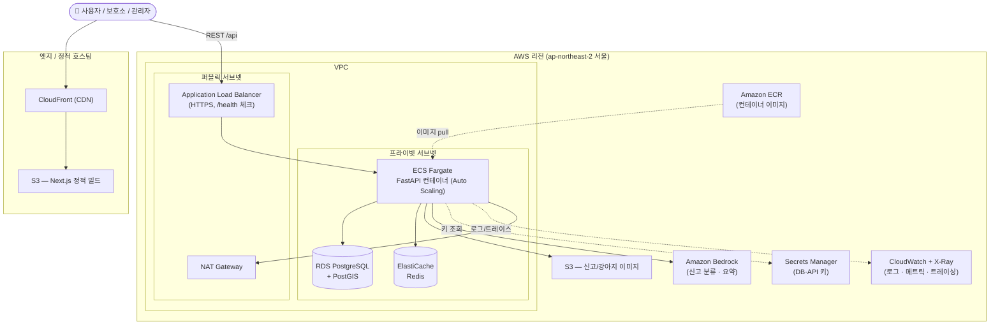
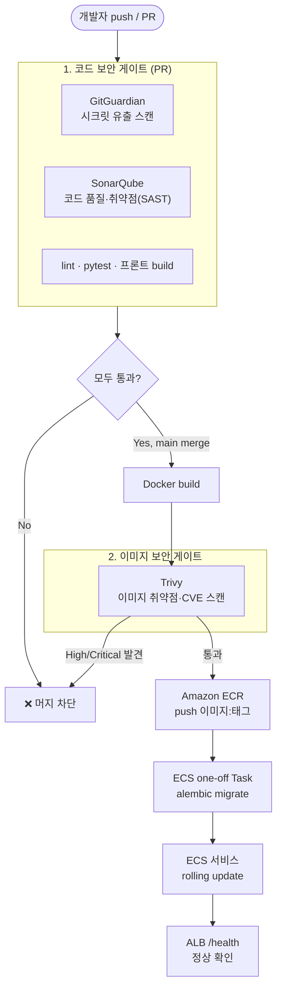
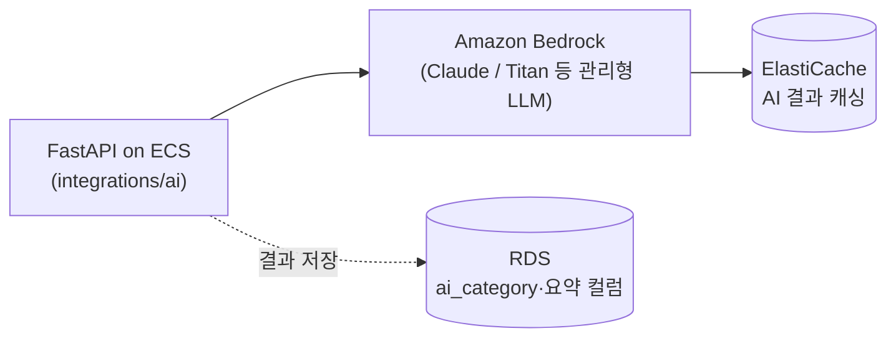

# PawTrace — AWS 인프라 아키텍처

> 목표: **Docker로 만든 동일 이미지**를 GitHub Actions로 빌드 → Amazon ECR에 저장 → **ECS Fargate**에 무중단 배포.
> MVP는 작게 시작하고(서버리스 컨테이너), 트래픽이 커지면 **EKS(Kubernetes)** 로 확장할 수 있도록 설계합니다.

---

## 1. 한눈에 보는 구성도 (MVP)

---

## 2. CI/CD 파이프라인 (GitHub Actions)

흐름: **PR 단계**에서 GitGuardian(시크릿)·SonarQube(코드 품질/SAST)·테스트를 모두 통과해야 머지 가능.
**main 머지** 시 Docker 빌드 → **Trivy**로 이미지 CVE 스캔 → ECR push → DB 마이그레이션 → ECS 롤링 배포 → 헬스체크.

### DevSecOps 도구 (CI/CD 보안 게이트)
| 단계 | 도구 | 역할 | GitHub Actions 연동 |
|---|---|---|---|
| 커밋(로컬) | **pre-commit** | 커밋 전 ruff·시크릿 검사 | `.pre-commit-config.yaml` |
| 커밋/PR | **GitGuardian** | 시크릿·API 키 유출 탐지 | `ggshield-action` (PR에서 차단) |
| PR | **Ruff + Pytest** | 린트 · 테스트 | CI `backend` job |
| PR | **SonarQube / SonarCloud** | 코드 품질 · 버그 · SAST 취약점 | `sonarqube-scan-action` + Quality Gate |
| PR | **Codecov** | 테스트 커버리지 리포트/게이트 | `codecov-action` |
| PR | **Hadolint** | Dockerfile 린트 | `hadolint-action` |
| 빌드 | **Trivy** | 컨테이너 이미지/의존성 CVE 스캔 | `aquasecurity/trivy-action` (HIGH/CRITICAL시 실패) |
| 빌드 | **Syft (SBOM)** | 소프트웨어 명세서 생성(공급망 가시성) | `anchore/sbom-action` |
| IaC | **Checkov / tfsec** | Terraform 보안 스캔 | P3, infra/ 연동 |
| 의존성 | **Dependabot** | 의존성 자동 업데이트 PR | `.github/dependabot.yml` |
| 공급망(P3) | **Cosign** | 이미지 서명/검증 | 배포 파이프라인 확장 |

> 원칙: **Shift-Left** — 문제를 배포 전 PR 단계에서 막는다. 시크릿은 절대 커밋되지 않고(pre-commit·GitGuardian), 코드 결함은 Quality Gate에서(SonarQube·Codecov), 알려진 취약점은 이미지 단계에서(Trivy), 공급망은 SBOM/서명(Syft·Cosign)으로 추적한다.

---

## 3. Azure → AWS 매핑표

| 역할 | (이전) Azure | (변경) AWS | MVP 포함 |
|---|---|---|---|
| 컨테이너 실행 | Container Apps | **ECS Fargate** | ✅ |
| 컨테이너 레지스트리 | ACR | **Amazon ECR** | ✅ |
| 관계형 DB | Azure DB for PostgreSQL | **RDS for PostgreSQL + PostGIS** | ✅ |
| 캐시 | Azure Cache for Redis | **ElastiCache for Redis** | P2 |
| 객체 스토리지(이미지) | Blob Storage | **Amazon S3** | ✅ |
| 정적 프론트 호스팅 | Static Web Apps | **S3 + CloudFront** | ✅ |
| 로드밸런서 | App Gateway / Front Door | **ALB** (+ CloudFront) | ✅ |
| AI | Azure OpenAI | **Amazon Bedrock** / OpenAI API | P2 |
| 비밀 관리 | Key Vault | **Secrets Manager** / SSM Parameter Store | ✅ |
| 모니터링 | App Insights / Azure Monitor | **CloudWatch + X-Ray (OpenTelemetry)** | P3 |
| IaC | Bicep | **Terraform** | P3 |
| 오케스트레이션 확장 | AKS | **Amazon EKS** | 향후 |
| CI 보안 스캔 | — | **Trivy · SonarQube · GitGuardian** | ✅(CI에 포함) |

---

## 3-1. AI 구성 (Amazon Bedrock)

AI는 PawTrace의 핵심 차별화 기능이지만, **MVP에서는 인프라만 연결해 두고 기능은 P2에서 활성화**합니다(비용·검증 부담 분리).

| AI 기능 | 설명 | 단계 |
|---|---|---|
| 신고 내용 분류 | 신고 텍스트를 카테고리로 분류(`reports.ai_category`) | P2 |
| 보호소/강아지 설명 요약 | 긴 설명을 짧게 요약 | P2 |
| AI 입양 가이드 | 사용자 답변 기반 준비사항 안내(결정은 사람) | P2 |
| Shelter Companion | 사진→소개글·성격·입양카드·SNS 초안 생성 | P2 |

설계 원칙
- LLM 호출은 `integrations/ai`에 격리(추후 Bedrock↔OpenAI 교체 가능).
- **비용 절감**: 동일 입력은 ElastiCache로 캐싱, 사진 카드 등은 비동기 사전 생성.
- **권한**: ECS Task Role(IAM)로 `bedrock:InvokeModel`만 부여, 키리스(keyless) 호출.
- **윤리 가드레일**: AI는 강아지를 점수화·랭킹하지 않으며, 추정값은 항상 "estimate" 라벨로 표기.

---

## 4. 네트워크 / 보안 원칙

- **VPC** 안에 퍼블릭/프라이빗 서브넷을 2개 AZ로 분리(고가용성).
- ALB만 인터넷에 노출. **ECS·RDS·Redis는 프라이빗 서브넷**에 두고 외부 직접 접근 차단.
- 프라이빗 서브넷의 아웃바운드(이미지 pull, 외부 API)는 **NAT Gateway** 경유.
- **Security Group**으로 최소 권한: ALB→ECS(8000), ECS→RDS(5432), ECS→Redis(6379)만 허용.
- DB 비밀번호·API 키는 코드/이미지에 넣지 않고 **Secrets Manager**에서 런타임 주입.
- 이미지·정적 자산은 S3 + CloudFront(HTTPS) 제공, 원본 S3는 비공개(OAC).

---

## 5. 비용을 아끼는 MVP 팁 (포트폴리오용)

- ECS Fargate **최소 task 1개**로 시작, Auto Scaling 정책만 정의해 둠.
- RDS는 `db.t4g.micro` 단일 인스턴스(프리티어 근접), 운영 시 Multi-AZ로 승격.
- Redis는 MVP에서 생략 가능 → P2에서 ElastiCache 추가.
- NAT Gateway 비용이 부담되면 초기엔 **VPC 엔드포인트(ECR/S3)** 로 일부 대체.

---

## 6. 확장 로드맵

| 단계 | 구성 |
|---|---|
| **MVP** | ECS Fargate(1 task) · RDS 단일 · S3 · ALB · CloudFront · GitHub Actions |
| **P2** | ElastiCache Redis · Bedrock AI · RDS Multi-AZ · Auto Scaling 활성화 |
| **P3** | CloudWatch/X-Ray 관측성 · Terraform IaC · 블루/그린(CodeDeploy) |
| **향후** | **EKS** 전환(HPA) · RDS read replica · 멀티리전 |

> 핵심: 같은 컨테이너 이미지를 ECS → EKS로 그대로 옮길 수 있어 마이그레이션 비용이 낮습니다.
